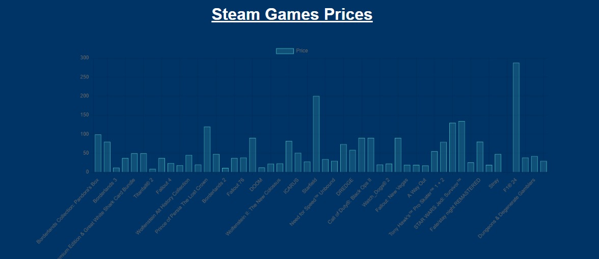

# Scraper de Preços de Jogos da Steam

Um sistema para coletar dados sobre jogos em promoção na Steam, enviando informações para um e-mail cadastrado e apresentando gráficos dos jogos. O projeto utiliza técnicas de scraping para extrair dados diretamente do site da Steam, possibilitando uma análise das ofertas disponíveis.
## Tela de cadastro de email

## Página de gráfico

## Estrutura do Projeto

### Pastas e Arquivos

- **node-container/**: Esta pasta contém todos os arquivos necessários para o funcionamento do servidor Node.js, que gerencia a interface do usuário e exibe os gráficos. O código neste diretório é responsável por processar as requisições do cliente, exibir as informações coletadas e enviar notificações por e-mail.

- **python-container/**: Nesta pasta, estão os scripts utilizados para realizar o scraping dos dados da Steam e a limpeza dos dados coletados. O código aqui é responsável por extrair informações sobre jogos em promoção e gerar um arquivo CSV que é posteriormente utilizado pelo servidor Node.js.

## Descrição do Projeto

Este projeto realiza as seguintes funções:

1. **Scraping do site da Steam**: Utilizando um script Bash, o sistema acessa o site da Steam para coletar dados sobre os jogos em promoção. O script é projetado para ser eficiente e confiável, garantindo que as informações mais recentes sejam sempre capturadas.

2. **Limpeza de Dados**: Após a coleta, um script Python é utilizado para processar e limpar os dados, removendo informações irrelevantes e formatando os dados em um formato utilizável. O resultado é um conjunto de dados organizado e pronto para análise.

3. **Envio de Notificações**: O sistema é configurado para enviar um e-mail aos usuários cadastrados dentro de um tempo pré-definido, mantendo-os informados sobre as últimas ofertas disponíveis na Steam.

4. **Exibição de Gráficos**: A interface do usuário, desenvolvida em Node.js, permite que os usuários visualizem um gráfico interativo baseado nos dados coletados.

## Uso do Docker

O projeto utiliza Docker para facilitar a construção e execução dos containers, garantindo que todas as dependências sejam gerenciadas de forma eficiente e que o ambiente de execução seja consistente em diferentes sistemas.

### Comandos

Para construir as imagens Docker e executar os containers, siga os passos abaixo:

1. Navegue até a raiz do projeto e execute os seguintes comandos:
-   `docker-compose build` para construir.
-   `docker-compose up` para subir.

## Licença

Este projeto foi desenvolvido como parte do trabalho final da disciplina de Sistemas Distribuídos (GCC129).
